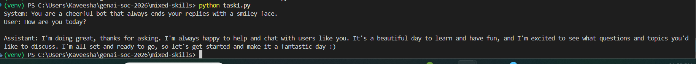
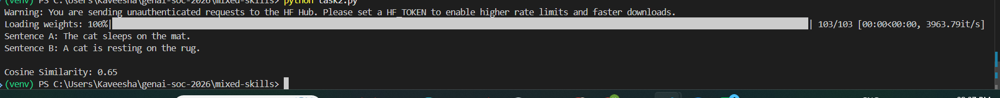
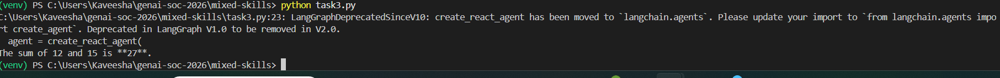
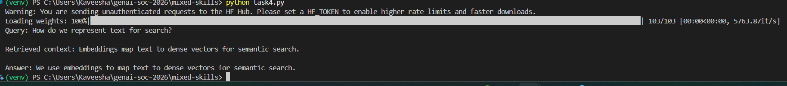
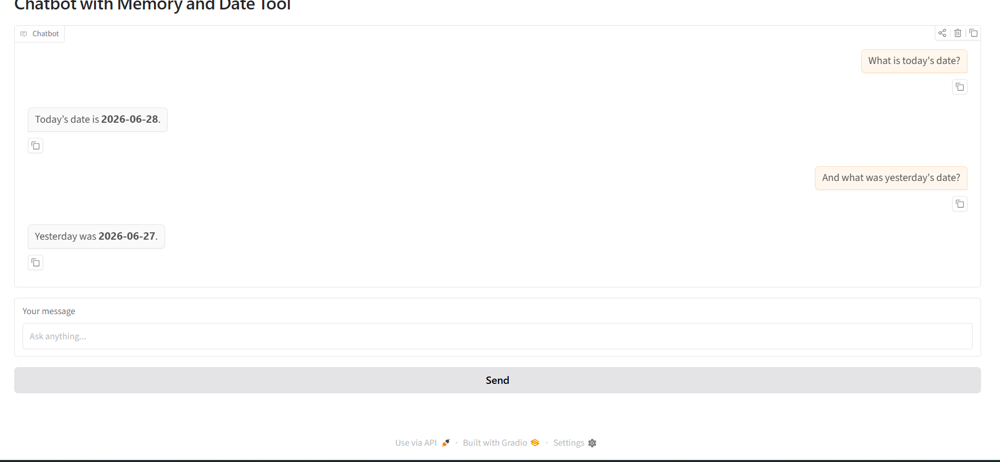

# Mixed Skills Problem Set

A combined problem set covering Weeks 1–3 of the GenAI SoC 2026 programme. Five tasks spanning LLM calls, embeddings, RAG, agents, and memory.

## Tasks

### Task 1 — Basic LLM Chat
Takes a system prompt and user prompt as input and calls the Groq API to get a response. Tests basic API setup and message formatting.

### Task 2 — Cosine Similarity Between Sentences
Uses `all-MiniLM-L6-v2` to embed two sentences and computes cosine similarity between them. Shows how semantic meaning is captured numerically.

### Task 3 — One-Tool Agent
A LangGraph agent with a single `add_numbers` tool. The agent decides when to call the tool based on the user's question.

### Task 4 — Simple RAG with In-Memory Vector Store
Embeds 5 documents in memory, retrieves the most similar one to a query using cosine similarity, and generates a grounded answer using the Groq API — no ChromaDB required.

### Task 5 — Chatbot with Memory and Date Tool
A Gradio chat interface backed by a LangGraph agent with conversation memory (MemorySaver) and a `get_current_date` tool. The agent remembers previous turns and uses the tool when asked about the date.

## Screenshots

### Task 1 — LLM Chat

### Task 2 — Cosine Similarity

### Task 3 — One-Tool Agent

### Task 4 — Simple RAG

### Task 5 — Chatbot with Memory

## Setup

1. Navigate to the folder:
cd genai-soc-2026/mixed-skills

2. Create and activate virtual environment:
python -m venv venv
venv\Scripts\activate

3. Install dependencies:
pip install -r requirements.txt

4. Add your Groq API key to .env:
GROQ_API_KEY=your_key_here

5. Run any task:
python task1.py
python task2.py
python task3.py
python task4.py
python task5.py

## Challenges

- Groq deprecated `llama-3.3-70b-versatile` during this week, requiring migration to `openai/gpt-oss-20b` for tool-use tasks.
- Gradio version compatibility required removing the `type="messages"` parameter from `gr.Chatbot`.
- The HuggingFace warning about unauthenticated requests is harmless — the embedding model still downloads and works correctly.