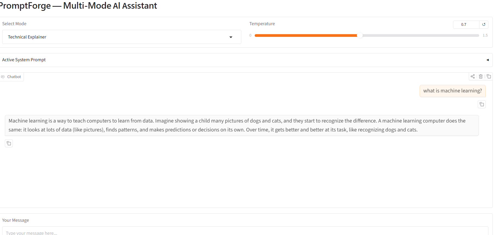
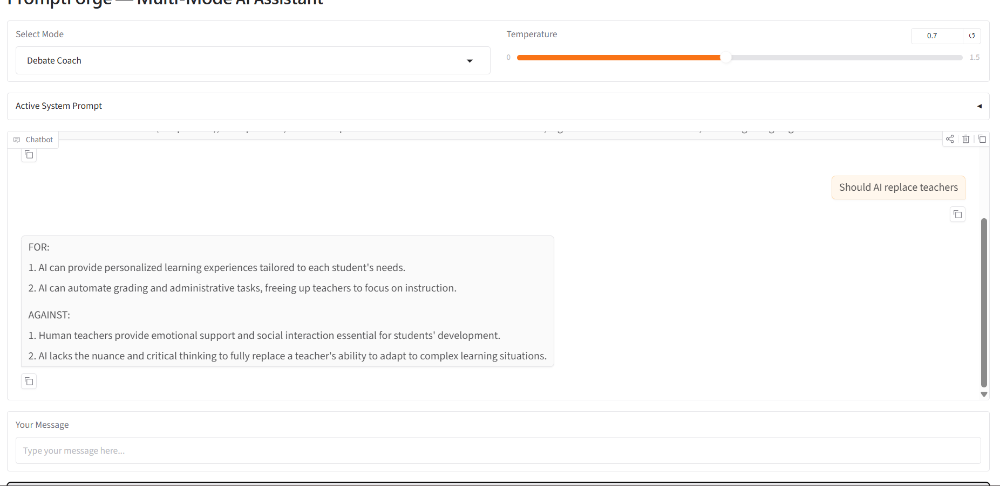
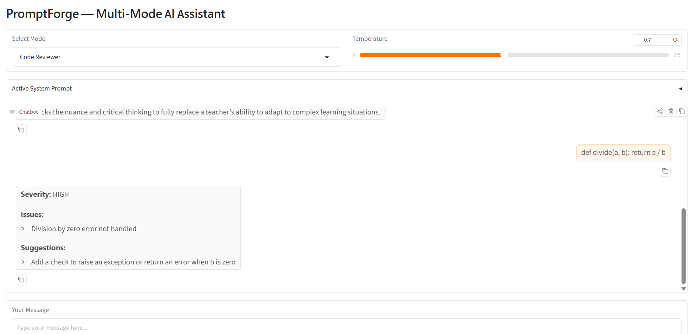
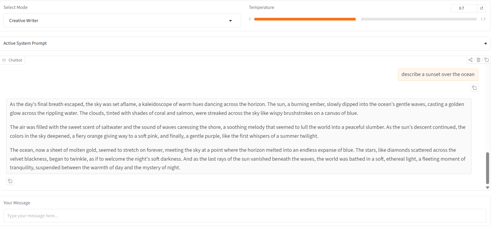

# PromptForge — Multi-Mode AI Assistant

A Gradio web app with 4 selectable AI personas, each with a unique system prompt, few-shot examples, and output style. Text streams token by token in real time.

## Modes

### 1. Technical Explainer
Breaks down complex topics in plain language for beginners.

### 2. Debate Coach
Argues both sides of any question with clear FOR and AGAINST points.

### 3. Code Reviewer
Reviews code and returns structured feedback (issues, suggestions, severity).

### 4. Creative Writer
Responds with vivid, imaginative prose styled like a novel.

## Screenshots

### Technical Explainer

### Debate Coach

### Code Reviewer

### Creative Writer

## Setup

1. Clone the repo:
git clone https://github.com/KaveeshaGupta/genai-soc-2026.git
cd genai-soc-2026/week1-promptforge

2. Create and activate virtual environment:
python -m venv venv
venv\Scripts\activate

3. Install dependencies:
pip install -r requirements.txt

4. Create your .env file:
cp .env.example .env
Add your Groq API key to .env

5. Run the app:
python app.py

6. Open your browser at http://127.0.0.1:7860