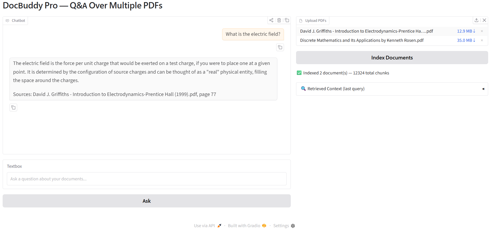
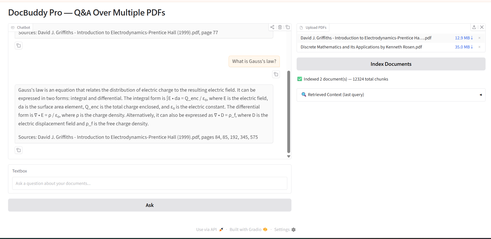
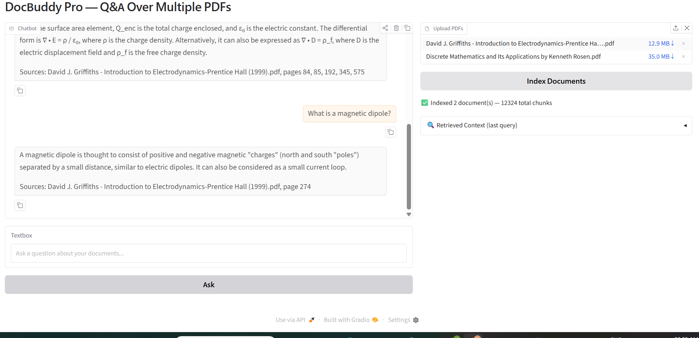
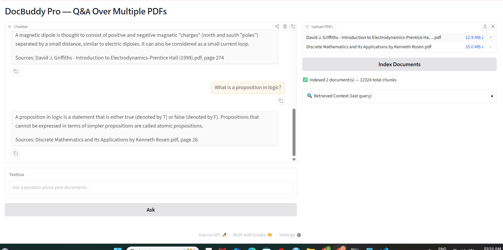
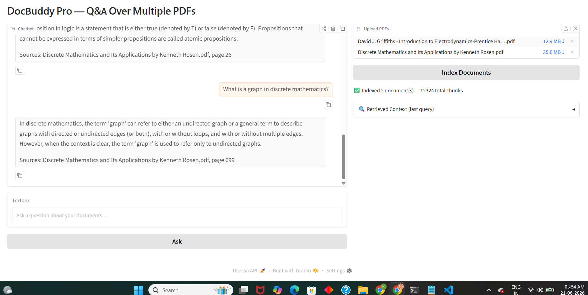
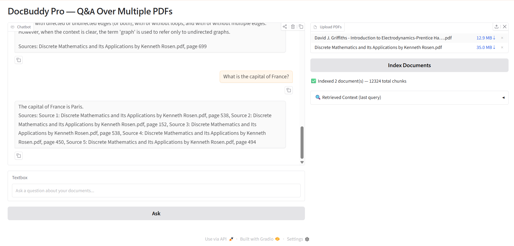
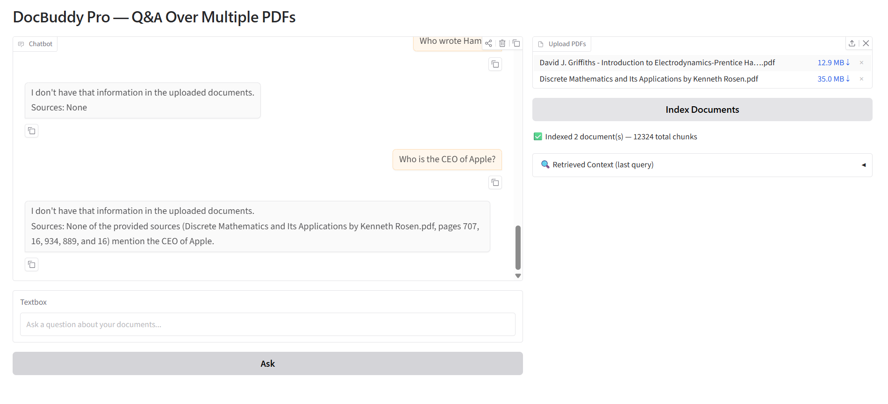
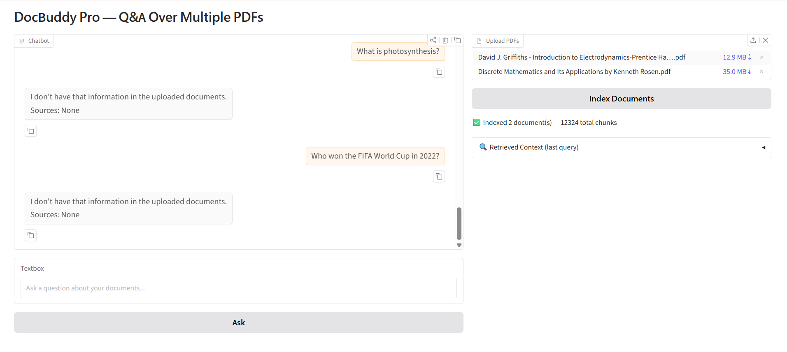

# DocBuddy Pro — Q&A Over Multiple PDFs

A Gradio app that lets you upload multiple PDFs and ask questions across all of them. Every answer cites the source document and page number. A collapsible panel shows exactly which chunks were retrieved for the last query.

## What is RAG?

RAG (Retrieval-Augmented Generation) is a technique where relevant chunks of your documents are retrieved and given to the AI as context before it answers. This means the AI answers from your documents rather than from its training data — reducing hallucinations and grounding answers in real sources.

## Features

- Upload multiple PDFs and index them into a local vector database (ChromaDB)
- Ask questions across all uploaded documents
- Every answer includes source filename and page number citations
- Retrieved context panel shows exactly which chunks the AI read
- Anti-hallucination: says "I don't have that information" for out-of-scope questions

## Screenshots

### From Griffiths — Introduction to Electrodynamics

### From Rosen — Discrete Mathematics

### Anti-hallucination tests

## Setup

1. Clone the repo and navigate to the project:
cd genai-soc-2026/week2-docbuddy

2. Create and activate virtual environment:
python -m venv venv
venv\Scripts\activate

3. Install dependencies:
pip install -r requirements.txt

4. Create your .env file and add your Groq API key:
GROQ_API_KEY=your_key_here

5. Run the app:
python app.py

6. Open http://127.0.0.1:7860 in your browser, upload PDFs, click Index Documents, then ask questions.

## Testing

### Multi-document retrieval
- Asked questions from Griffiths Electrodynamics — answered correctly with page citations
- Asked questions from Rosen Discrete Mathematics — answered correctly with page citations
- Both documents indexed simultaneously, citations correctly reflect which book each answer came from

### Anti-hallucination
- Asked 5 out-of-scope questions (Hamlet, Apple CEO, France capital, photosynthesis, FIFA)
- All 5 correctly responded with "I don't have that information in the uploaded documents"

## What worked well and what I'd improve

Source citations and anti-hallucination grounding worked really well. I'd improve it by adding streaming responses and per-document filtering so users can restrict questions to a specific PDF.