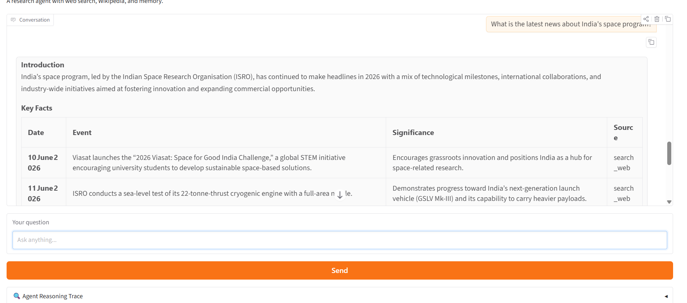
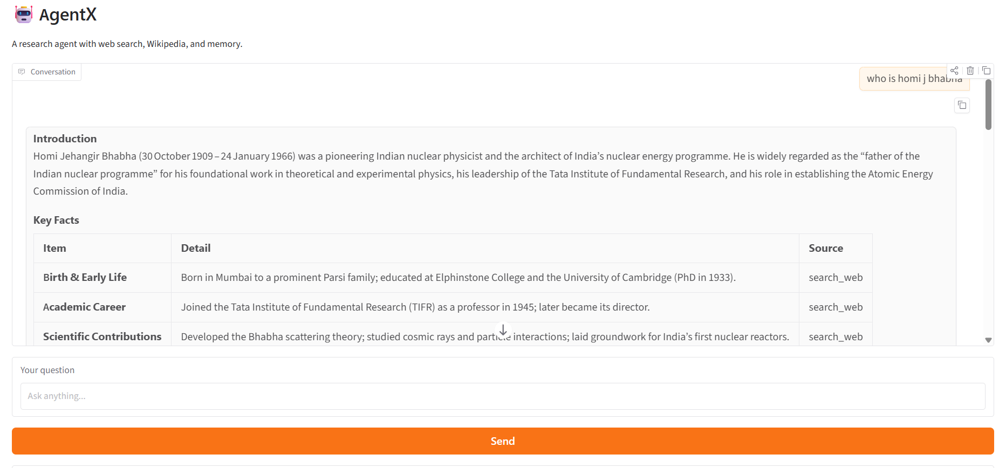
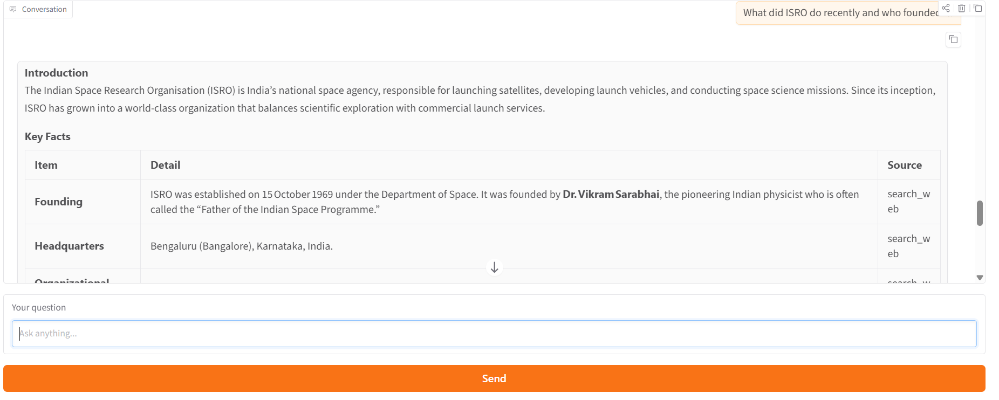
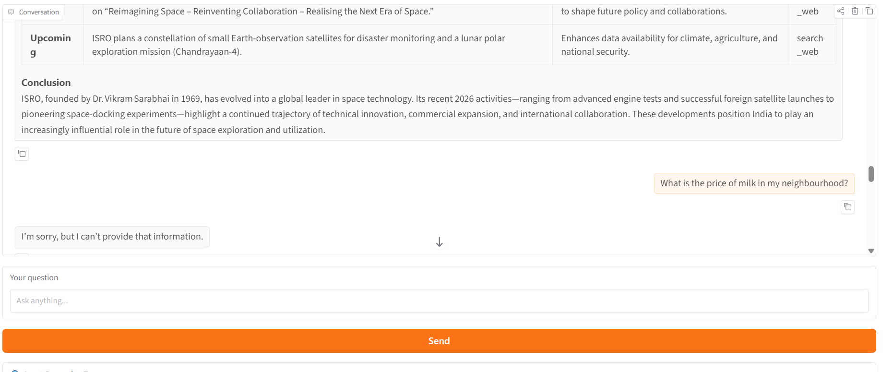
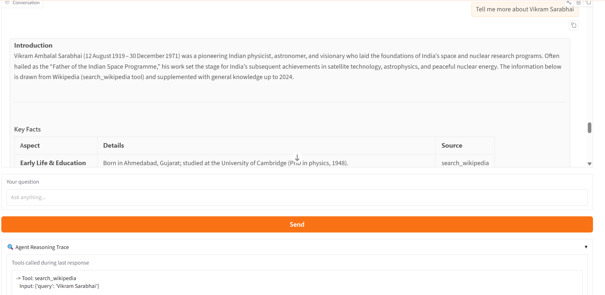

# AgentX — Research Agent with Memory and Visible Reasoning

A Gradio chatbot backed by a LangGraph agent that researches any topic using web search and Wikipedia. It maintains conversation memory across turns and exposes a collapsible reasoning trace panel so the user can see exactly which tools were called.

## What is a ReAct Agent?

A ReAct agent reasons and acts in a loop: it thinks about what to do, calls a tool, observes the result, then thinks again. This continues until it has enough information to answer. LangGraph's `create_react_agent` handles this loop automatically.

## Tools

- **search_web** — DuckDuckGo search for real-time news and current events
- **search_wikipedia** — Wikipedia for historical facts, scientific concepts, and background knowledge
- **get_current_date** — Returns today's date so the agent knows what "current" means

## Screenshots

### Current events query — India's space program

### Historical query — Homi J. Bhabha

### Multi-tool query — ISRO recent news and founder

### Unanswerable query — Milk price

### Memory test — Follow-up on Vikram Sarabhai

## Setup

1. Clone the repo and navigate to the project:
cd genai-soc-2026/week3-agentx

2. Create and activate virtual environment:
python -m venv venv
venv\Scripts\activate

3. Install dependencies:
pip install -r requirements.txt

4. Create your .env file:
GROQ_API_KEY=your_key_here

5. Run the app:
python app.py

6. Open http://127.0.0.1:7860 in your browser

## Test Results

1. **Current events** — "What is the latest news about India's space program?" → Answered using DuckDuckGo with recent developments
2. **Historical** — "Who was Homi J. Bhabha?" → Answered using Wikipedia with full biography
3. **Multi-tool** — "What did ISRO do recently and who founded it?" → Used both DuckDuckGo and Wikipedia
4. **Unanswerable** — "What is the price of milk in my neighbourhood?" → Correctly said it couldn't answer
5. **Memory** — "Tell me more about Vikram Sarabhai" → Agent remembered context from previous answer

## What I'd improve

- The model sometimes returns empty responses for certain queries — adding automatic retry logic would help
- Streaming responses token by token would improve UX
- Per-topic memory reset button would be useful for starting fresh research sessions