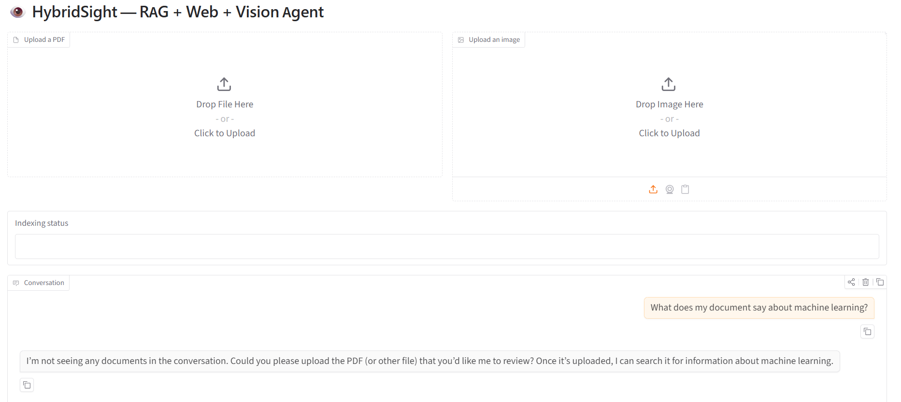
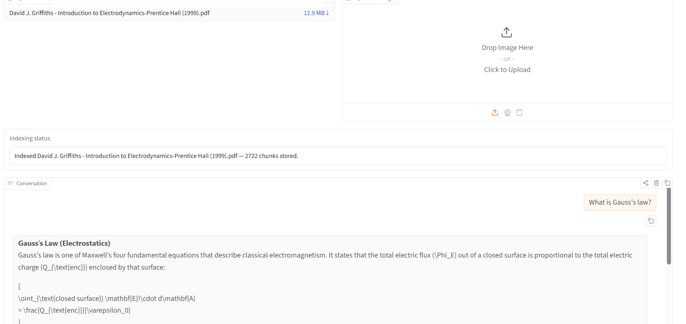
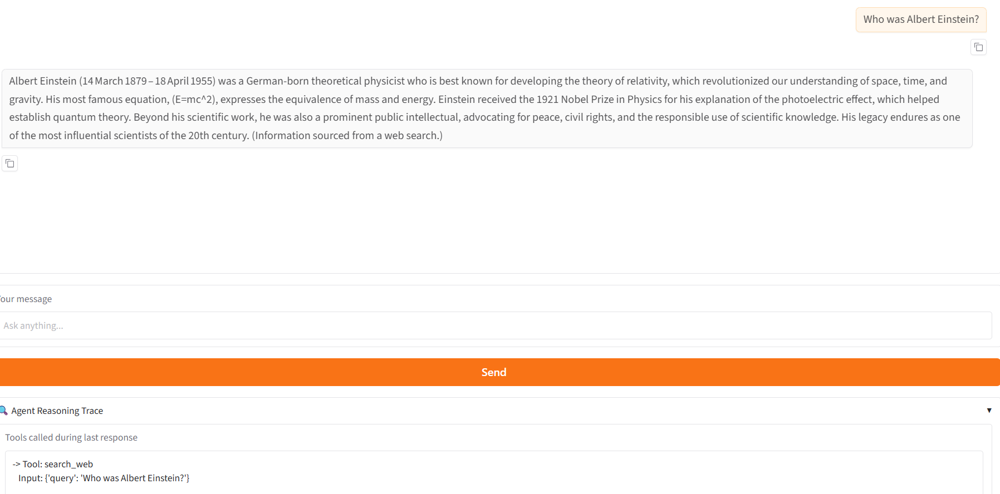
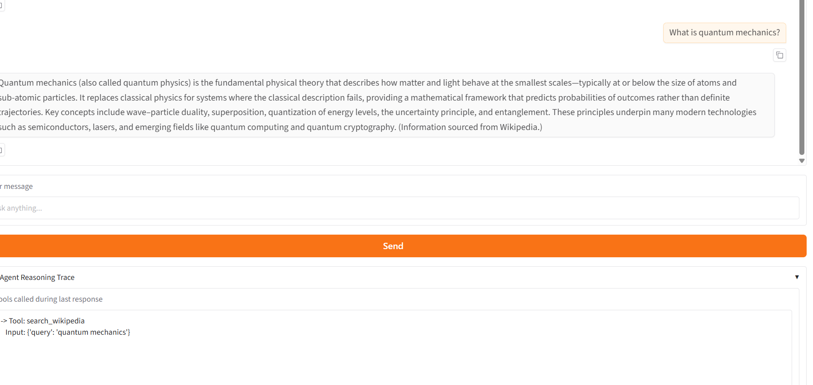

# HybridSight — RAG + Web Search + Vision Agent

A Gradio app backed by a single LangGraph agent that can answer from uploaded PDFs, the live web, and (conceptually) uploaded images — all in one conversation, with a reasoning trace showing exactly which tool was used.

## What it does

HybridSight combines three capabilities from the previous weeks into one agent:
- **RAG (Week 2)** — indexes uploaded PDFs into ChromaDB and retrieves relevant chunks to answer document-specific questions
- **Web Search (Week 3)** — uses DuckDuckGo to answer current events and general knowledge questions
- **Vision (Week 5)** — architecture supports image uploads, but vision processing is currently limited by Groq free tier token limits (see Known Limitations)

## How the agent routes

The agent reads the user's message and decides which tool to use based on tool descriptions:
- "my document / my notes / the file" → `search_documents`
- everything else → `search_web`

## Screenshots

### Test 1 — No documents uploaded (graceful handling)

### Test 2 — PDF uploaded, document question

### Test 3 — Current events (web search)

### Test 4 — General knowledge (web search)

## Known Limitations

**Vision is not functional on Groq's free tier.** The vision feature requires sending base64-encoded images through the API, which uses 30,000–40,000 tokens per image. Groq's free tier models have a limit of 6,000–8,000 tokens per request, making vision processing impossible without upgrading to a paid tier. The architecture and code for vision are fully implemented — `tools_vision.py` contains the `describe_image` tool using `openai/gpt-oss-120b` — but it cannot be demonstrated on the free tier.

## Setup

1. Navigate to the folder:
cd genai-soc-2026/week5-hybridsight

2. Create and activate virtual environment:
python -m venv venv
venv\Scripts\activate

3. Install dependencies:
pip install -r requirements.txt

4. Add your Groq API key to .env:
GROQ_API_KEY=your_key_here

5. Run the app:
python app.py

6. Open http://127.0.0.1:7860 in your browser

## Project Structure

- `agent.py` — LangGraph agent with routing logic and memory
- `tools_rag.py` — RAG tool wrapping ChromaDB retrieval
- `tools_vision.py` — Vision tool (implemented but limited by free tier)
- `app.py` — Gradio UI with PDF upload, image upload, and reasoning trace